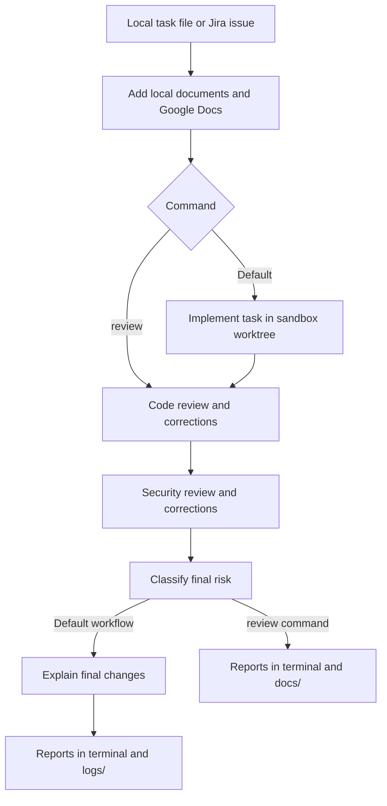

# Soft Factory

[Read the documentation](https://ernesto27.github.io/ai-tools/soft-factory/).

Soft Factory is a command-line tool that uses `agent-sandbox` to implement a task, review the changes, apply corrections, assess the final risk, and explain the final changes.

You can provide a task from a local file or a Jira issue, and include supporting documents from local files or Google Drive.

## Configuration

Create these two files in the project folder before running Soft Factory.

### `software-factory.json`: supporting documents and custom skills

The CLI always reads `software-factory.json` from the current working directory.
Rename an existing `config.json` to `software-factory.json`; there is no fallback
to the old filename, and `--config` / `-c` are no longer supported.

All property names use lower camelCase, including nested properties. These are all the options currently supported:

| Option | Purpose |
| --- | --- |
| `documents` | Optional list of local document paths. Paths resolve relative to this configuration file. Use `[]` or omit it when no local documents are needed. Blank paths are rejected. |
| `googleDrive` | Optional Google Drive settings. When present, at least one of `folders` or `files` must contain an entry. Omit this section when Drive is not needed. |
| `googleDrive.folders` | Optional list of exact folder names. Each name must identify one accessible folder. Blank names are rejected. |
| `googleDrive.files` | Optional list of full Google Docs URLs. Documents can be outside the configured folders. URLs are validated when configuration loads, before the Drive client starts. |
| `customSkills` | Optional project skills that extend the bundled stage skills. |
| `customSkills.codeReview` | Optional project skill name for the code review stage. |
| `customSkills.securityReview` | Optional project skill name for the security review stage. |
| `customSkills.riskClassification` | Optional project skill name for the risk classification stage. |
| `customSkills.reviewChanges` | Optional project skill name for the final review-changes walkthrough. |
| `disabledStages` | Optional list of stages to skip: `implementation`, `codeReview`, `securityReview`, `riskClassification`, or `reviewChanges`. See [Disabling stages](#disabling-stages). |

Minimal example:

```json
{
  "documents": []
}
```

To add project-specific review instructions, set skill names per stage. Skill
names keep their own spelling; only property names use camelCase:

```json
{
  "customSkills": {
    "codeReview": "test-code-review",
    "securityReview": "test-security-review",
    "riskClassification": "test-risk-classification",
    "reviewChanges": "test-review-changes"
  }
}
```

Each name must be one directory name, not a path. Soft Factory searches for
`.agents/skills/<name>/SKILL.md` first, then `.claude/skills/<name>/SKILL.md`,
relative to `software-factory.json`, and gives the first match to that stage
after its default skill. A configured skill for an enabled stage that is missing
or cannot be read stops the workflow before implementation with an error.

Example using both local documents and Google Drive:

```json
{
  "documents": ["requirements.md", "guidelines.md"],
  "googleDrive": {
    "folders": ["Project Documentation"],
    "files": ["https://docs.google.com/document/d/DOCUMENT_ID/edit?tab=t.0"]
  }
}
```

Google Drive requires a separate credentials JSON file named **`service_account.json`** in the project folder. This is the service-account key downloaded from Google Cloud, not `software-factory.json`. The filename and location are fixed in the current version.

The downloaded file must contain service-account credentials, including:

```json
{
  "type": "service_account",
  "client_email": "drive-reader@YOUR_PROJECT_ID.iam.gserviceaccount.com",
  "private_key": "..."
}
```


When `googleDrive` is configured, a missing or invalid credentials file stops the workflow. Without `googleDrive`, this file is not required. Keep the key private; `service_account*.json` files are ignored by Git.

Folder loading includes only Google Docs directly inside the selected folders. Individual URLs load the specified Google Docs regardless of their folder. See [Google Drive setup](GOOGLE_DRIVE_SERVICE_ACCOUNT_SETUP.md) for download and sharing instructions.

#### Disabling stages

To skip stages without changing their order, list them in `disabledStages`.
Omitting the property or using `[]` runs every stage as before:

```json
{
  "documents": ["task.txt"],
  "disabledStages": ["securityReview", "riskClassification"]
}
```

| Stage | Default workflow | `review` | `continue` |
| --- | --- | --- | --- |
| `implementation` | Yes | No | Yes |
| `codeReview` | Yes | Yes | Yes |
| `securityReview` | Yes | Yes | Yes |
| `riskClassification` | Yes | Yes | Yes |
| `reviewChanges` | Yes | No | Yes |

Names are exact and case-sensitive. Kebab-case names such as
`security-review`, other spellings, blank or padded names, `null`, and
non-string entries are rejected before any agent runs, for example:

```text
Error: validate factory configuration: disabledStages[0]: unknown stage "securityReveiw"; allowed: implementation, codeReview, securityReview, riskClassification, reviewChanges
```

Duplicates are allowed. Listing a stage that the selected command never runs,
such as `implementation` with `review`, has no effect. Each skipped stage
prints `Skipping disabled stage: <name>` and, in the default workflow and
`continue`, adds that line to `summary.log`. Skipped stages start no agent,
create no stage log or report, and do not load their configured custom skill,
so a missing skill file does not block a disabled stage. Skill names are still
validated.

Disabling a stage never disables later stages. Risk classification uses only
the reports from reviews that ran in the current invocation and states when
review evidence is missing. Disabling `implementation` does not change branch
selection: the default workflow still uses `run.branch`, so that sandbox
worktree must already exist, and the final walkthrough still runs unless
`reviewChanges` is also disabled. Existing environment, branch, Jira, and
document checks still run when every stage is disabled; the command then
succeeds without starting an agent.

### `agent-sandbox.json`: agent and task

The `run` section controls implementation. The `resume` section controls code review, security review, risk classification, and the final change walkthrough. Set the same branch in both sections so all stages use the same sandbox worktree.

Example for a local task:

```json
{
  "run": {
    "agent": "codex",
    "branch": "factory-task",
    "file-prompt": "task.txt",
    "push": false,
    "pr": false
  },
  "resume": {
    "agent": "codex",
    "branch": "factory-task",
    "push": false,
    "pr": false
  }
}
```

Choose a new branch name for each new task. For review-only runs, use an existing sandbox branch in `resume.branch`; list available branches with `agent-sandbox worktree-list`.

Example for a Jira task, where `--jira` supplies the task instead of a local file:

```json
{
  "run": {
    "agent": "codex",
    "branch": "eng-123",
    "push": false,
    "pr": false
  },
  "resume": {
    "agent": "codex",
    "branch": "eng-123",
    "push": false,
    "pr": false
  }
}
```

Common settings in either section:

| Option | Purpose |
| --- | --- |
| `agent` | Agent to use: `codex`, `claude`, `opencode`, or `pi`. Reviews require subagent support. |
| `branch` | Sandbox branch to create (`run`) or continue (`resume`). |
| `file-prompt` | Local task file, relative to the working directory. Set it in `run` for local tasks; Soft Factory supplies the review prompts. |
| `model` | Optional model selection; otherwise use the agent's default. |
| `base-image` | Optional container image with the tools your task needs, such as `golang:1.26-alpine` for Go tasks. |
| `api-key` | Optional API key for Codex or Claude. Otherwise, use the agent's existing host authentication. |
| `push` | Commit and push changes after a sandbox stage. The examples leave this disabled. |
| `pr` | Commit, push, and create or reuse a GitHub pull request after a sandbox stage. The examples leave this disabled. |
| `commit-message` | Optional commit message when `push` or `pr` is enabled. |
| `hn` | Allow the container to access host services; defaults to `false`. |
| `image` | Optional list of image paths to attach for agents that support them. |
| `query` | Inline prompt supported by `agent-sandbox`. For Soft Factory, use `run.file-prompt` or `--jira` to keep the original task available to every stage. |

Soft Factory supplies generated prompts for reviews and for tasks with supporting context or Jira input. Do not set a separate review prompt in `resume`.

## Requirements

- Go 1.25.3 or later when building from source.
- `agent-sandbox` installed and configured.
- Docker running and the selected agent authenticated.

Run the commands below from the project folder.

Check installed dependencies before configuring a workflow:

```bash
software-factory doctor
```

Doctor checks `agent-sandbox`, `git`, and `docker` on `PATH`, then displays all
results together in a table with Dependency, Status, and Path columns.
`FOUND` is green and `MISSING` is red by default; set a non-empty `NO_COLOR`
to disable colors.
The command exits with status 0 when all three are found and 1 if any are
missing. It works without configuration files and does not check agent CLIs,
API keys, versions, or Docker daemon access.

## Installation

For Linux x86_64, run [install.sh](https://github.com/ernesto27/ai-tools/blob/master/soft-factory/install.sh) with curl:

```bash
curl -fsSL https://raw.githubusercontent.com/ernesto27/ai-tools/master/soft-factory/install.sh | bash
```

The installer downloads `software-factory_linux_amd64.tar.gz` from the latest Software Factory release, verifies its SHA-256 checksum, and installs `software-factory` in `~/.local/bin`. Set `INSTALL_DIR` to choose a different destination. Add that directory to your `PATH` if needed.

Alternatively, build from this folder:

```bash
go build -o /tmp/software-factory ./cmd/factory
install -Dm755 /tmp/software-factory "$HOME/.local/bin/software-factory"
```

Run `software-factory` or `software-factory review` from the project you want to work on. Create the configuration and task files there as described below. Review skills are bundled in the binary; files at `skills/<skill-name>/SKILL.md` in the working directory override the bundled instructions.

Run `software-factory -v` or `software-factory --version` to print the binary's release tag. Binaries built locally without an injected release tag print `dev`. These flags do not require configuration files.

The repository-root GitHub workflows run tests, vet, formatting checks, and a CLI build for `soft-factory/`. Pushing a tag matching `software-factory-v*` builds and publishes the Linux x86_64 archive and checksum after tests and vet pass.

## Getting started

1. Write your task in `task.txt`.
2. Create `agent-sandbox.json` using the local-task example above.
3. Create `software-factory.json`. If you do not need supporting documents, use:

   ```json
   {"documents": []}
   ```

4. Start the workflow:

   ```bash
   go run ./cmd/factory
   ```

Soft Factory runs these stages in order:

1. Implement the task.
2. Review the code and apply corrections.
3. Review security and apply corrections.
4. Classify the final risk as **LOW**, **MEDIUM**, **HIGH**, or **UNKNOWN**.
5. Write a read-only walkthrough of the final changes, including diff lines and flow diagrams.

The default workflow saves logs in `logs/<branch>-<UTC-datetime>/`, using the
sandbox worktree branch from `agent-sandbox.json` (`run.branch`). Branch slashes
become hyphens, so `feature/logs` appears as `feature-logs`. Each
first four stages have position-prefixed files (`01-implementation.log`,
`02-code-review.log`, `03-security-review.log`, and
`04-risk-classification.log`); another attempt at a stage uses a numbered file
such as `01-implementation-2.log`. Each stage file includes the run details
and that stage's result. A stage that never starts has no file. The CLI prints
the directory path when the run starts and continues to show stage output
live. The final stage writes `05-review-changes.md` as the only Markdown file
in the default run directory. The code review, security review, and risk classification
output stays in their stage logs. The standalone `review` command does not run
the final stage or create these logs; its three reports remain in `docs/`.

Each review stage allows up to three rounds. Reviews require reviewer and fixer subagents; unavailable subagents or incomplete necessary verification are reported as **BLOCKED**.

## Workflow



Each code or security review follows **review → corrections when needed → verification**, with up to three rounds. Failures before the final walkthrough stop the workflow. A walkthrough failure warns and does not change the exit status.

## Review existing changes

Skip implementation and review the changes in the sandbox worktree selected by `resume.branch`:

```bash
go run ./cmd/factory review
```

This command can modify files to correct review findings.

## Use a Jira task

Set `JIRA_EMAIL` and `JIRA_API_TOKEN` in your environment or in a local `.env` file. You can use `.env.example` as a starting point.

```bash
go run ./cmd/factory --jira 'https://your-company.atlassian.net/browse/ENG-123'
```

To review existing changes against a Jira task:

```bash
go run ./cmd/factory --jira 'https://your-company.atlassian.net/browse/ENG-123' review
```

The issue summary and description replace the local task for every stage. Comments and attachments are not included. Supporting documents still apply, and `software-factory.json` is still required.

See [Jira setup](JIRA_SETUP.md) for supported credentials and configuration.

## Add supporting documents

List local documents in `software-factory.json`:

```json
{
  "documents": ["requirements.md", "guidelines.md"]
}
```

Document paths are relative to the configuration file. Their contents accompany the task throughout the workflow.

To also include Google Docs from shared Drive folders:

```json
{
  "documents": ["requirements.md"],
  "googleDrive": {
    "folders": ["Project Documentation"]
  }
}
```

Save your service-account key as `service_account.json` in the project folder and share the Drive folder with that account. Folder names must identify a single accessible folder. Only Google Docs directly inside the selected folders are included; subfolders and other file types are excluded.

To load individual Google Docs without loading their folders, use `files`:

```json
{
  "googleDrive": {
    "files": [
      "https://docs.google.com/document/d/DOCUMENT_ID/edit?tab=t.0"
    ]
  }
}
```

Replace the example URL with your document's full Google Docs URL.
You can configure `folders` only, `files` only, or both in the same `googleDrive` block. At least one array must contain an entry. Individual documents can be in different folders, provided the service account has access to them. Invalid URLs fail when configuration loads; inaccessible documents or export errors stop the workflow during context loading.

See [Google Drive setup](GOOGLE_DRIVE_SERVICE_ACCOUNT_SETUP.md) for instructions.

## Reports

Reports appear in the terminal. The default workflow saves the code review,
security review, and risk classification output in their `.log` files, and
only the final walkthrough as `logs/<run>/05-review-changes.md`.
The standalone `review` command saves its three reports as timestamped
Markdown files in `docs/` because it has no run log directory.

The default workflow's `05-review-changes.md` shows the changed code lines,
file-by-file explanations, findings, and flow diagrams. Terminal setup and
command output from that final stage are shown live but are not saved in the
Markdown file. The agent writes the report in its sandbox worktree; Soft Factory
copies it to the run logs and removes the worktree copy.
Findings in this report are informational. If the report cannot be generated
or saved, Soft Factory prints a warning and keeps the result of the earlier
stages.

Run `./test-factory` from the repository root to execute the full implementation
workflow using `software-factory.json`, then check its new report. The script requires a
plain text flow diagram in the Markdown file and rejects Mermaid code fences.

Review reports include their status (**PASS**, **UNRESOLVED**, or **BLOCKED**), corrections, remaining findings, and verification gaps. Read the reports before accepting the changes: a successful command exit does not guarantee that every finding was resolved.

Local configuration, credentials, task files, and generated reports are ignored by Git. Keep sensitive content out of commits.
